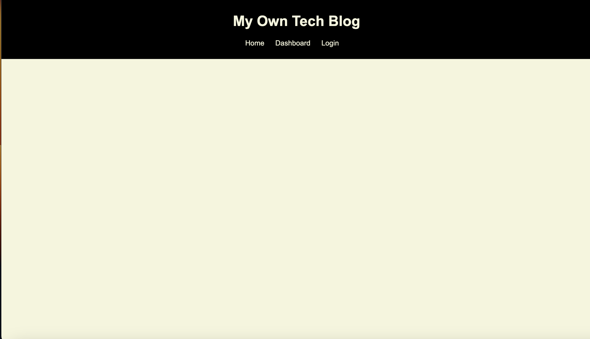

## My Own Tech Blog
https://agile-badlands-68416-6507fd436a5c.herokuapp.com/

## Description
Tech Blog is a web application that allows users to create, view, and manage blog posts related to technology. Users can create an account, log in, create new blog posts, comment on existing posts, and edit or delete their own posts.

## Usage
To use the Tech Blog application, start by visiting the website. You can browse existing blog posts on the homepage. To create a new blog post, you need to create an account or log in if you already have one. Once logged in, you can access the dashboard to create, edit, or delete your blog posts. You can also comment on other users' posts.

### Home Page

## Ideas for future improvement
- Make it actually work
- Add image upload functionality for blog posts.
- Implement a tagging system to categorize posts.
- Allow users to like or upvote blog posts.

## Credits
Please see the following sites that were used:
### Starter Code
Started modeling of Mini Project Code from Edx Bootcamp
Received Assistance from AskBCS
Benicio - Middleware Setup
Quinton - Fix Server.js Page

### Heroku help
https://devcenter.heroku.com/articles/logging

